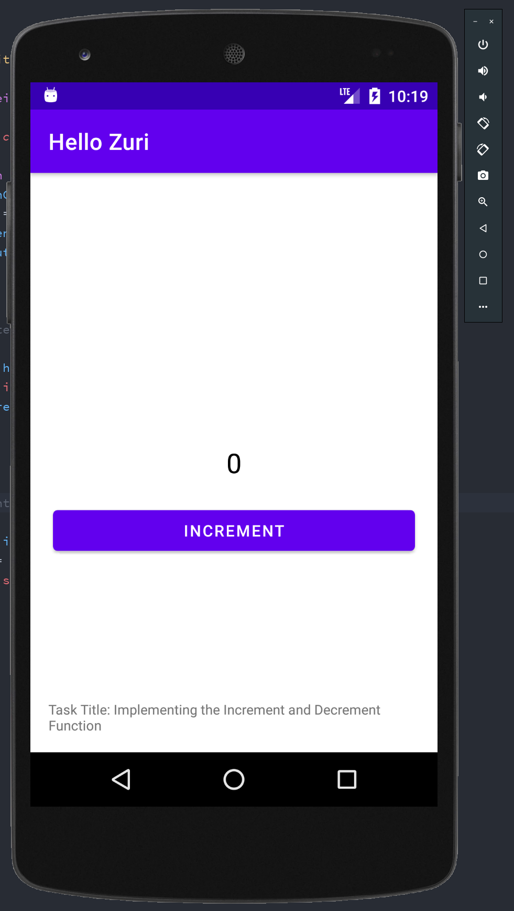

# Hello Zuri
 Task Title: Implementing the Increment and Decrement Function

    This project is a solution to the task above given by Zuri to show some of the skills learnt so far in android development to build a simple app
    Using:
    * Kotlin

 ## Link To APK
 * [Guide to app architecture](https://developer.android.com/jetpack/guide)
